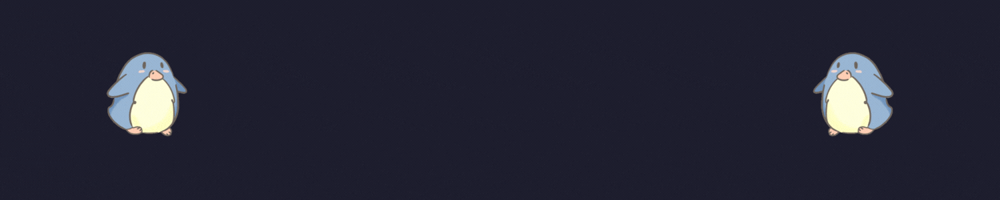

<!-- ZELFROSTER's README -->

 
 

<code>:snowflake: $ whoami</code>

    :dizzy: I am a Frontend Developer with a love for Linux, Design and 
    pushing boundaries.

<code align="center">:snowflake: $ cat myskillset</code>

    
    
    
    
    
    
    
    
    
    
    
    
    
    
    

<code style="margin-bottom: 0px" class="ping">:snowflake: $ ping zelfroster</code>

    
    

    

<!-- If you are copying this then star this repo -->

<!--

-->
